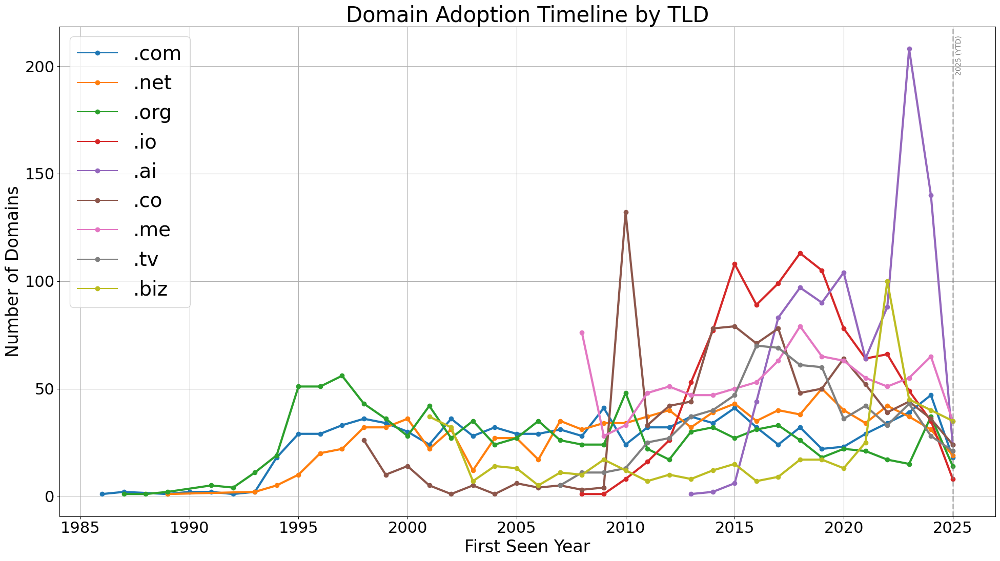

# TLD Popularity Trends Over Time

This notebook explores how the use of different top-level domains (TLDs) — including `.com`, `.net`, `.org`, `.io`, `.ai`, and others — has changed over time.

We sampled a mix of top-ranked and randomly selected domains from each TLD and used public certificate transparency logs and WHOIS data to estimate when each domain first appeared. The goal was to understand when certain TLDs, especially alternative or trendy ones like `.io` and `.ai`, started gaining traction.

The final visualizations show clear shifts in TLD popularity over time and highlight how some extensions rose (or fell) with broader trends in tech and startup culture.




---

## 🔧 Usage

To clone the repo and run your own analysis:

```
git clone https://github.com/yourusername/tld-trends-research.git
cd tld-trends-research
python -m venv venv && source venv/bin/activate  # or use your preferred environment
pip install -r requirements.txt
```

Then open the notebook in Jupyter:

```
jupyter notebook tld-trends.ipynb
```

You'll need to create your own account with the [Whois API provider](https://apilayer.com/marketplace/whois-api) in order to scrape your own Whois records. Their free tier offers 3,000 request per month or they have a $4.99/mo "starter" plan that will give you up to 150,000. Once you have your own API key, paste it in place of `your_whois_api_key_here` in `.env.example` and rename the file to `.env`